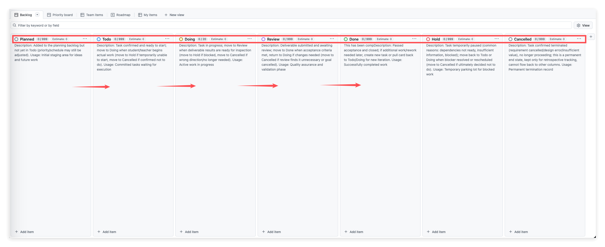

# Getting Started with GitHub Projects for Task Management

## 📋 What You'll Learn

By the end of this section, you'll be able to:

- Understand the core ideas behind Kanban-style task management
- Navigate the basic workflow in GitHub Projects
- Use the Comment feature for effective asynchronous communication

## 🎯 Why This Matters

Picture this: you and a coworker are discussing tasks over WeChat. Messages pile up, and after scrolling for five minutes you still can't find "that thing we talked about last time." Worse, you think you're done — but they think you haven't even started. You're completely out of sync.

This kind of chaos is incredibly common in the workplace, and GitHub Projects exists to solve it.

Think of it as a **transparent task board**: every task is visible at a glance so nothing slips through the cracks. Everyone can see who's working on what and how far along they are. All discussions and deliverables live in one place instead of being scattered across chat threads.

Kanban-style project management is the standard collaboration model at American tech companies. Whether it's a startup or a major corporation, you'll encounter tools like this — maybe Jira, Asana, Trello, or GitHub Projects itself. Getting comfortable with this workflow now means you'll hit the ground running when you start a new job.

---

## 📖 The Big Picture: Understanding Board Columns

When you open GitHub Projects, you'll see a board view with several columns. Each column represents a different task status.

A typical board includes these status columns:



| Column | What It Means | Who Manages It |
| --- | --- | --- |
| **Planned** | Tasks your mentor has queued up | Managed by your mentor — **don't touch these** |
| **Todo** | Tasks assigned to you | Pick tasks from here to get started |
| **Doing** | Tasks you're actively working on | You drag cards here |
| **Review** | Done on your end, waiting for review | You drag cards here + leave a comment |
| **Done** | Approved by your mentor | Moved by your mentor |
| **Hold** | Temporarily on pause | Managed by your mentor |
| **Cancelled** | Tasks that are no longer needed | Managed by your mentor |
| Different teams may customize the number and names of columns, but the core logic stays the same: **tasks flow from left to right, representing the journey from "planned" to "completed." As the person doing the work, you generally only need to focus on three columns: Todo → Doing → Review.** |  |  |

---

## 📖 The Core Workflow

### Step 1: Pick a task from the Todo column

Open the board and look at the **Todo** column — this is where assigned tasks sit, waiting for someone to start them. Click on any task card to see its full description, due date, related links, and other details.

When choosing a task, consider priority and deadlines. If you're not sure what to tackle first, check with your project lead.

### Step 2: Start working — drag the card to Doing

When you're ready to begin, click and hold the task card, drag it over to the **Doing** column, and release.

This simple action carries real significance: it tells every member of the team that you're on it. No duplicate work, no "I thought you were handling that" / "I thought you hadn't started" miscommunication.

### Step 3: When you're done, move it to Review and leave a comment

Once you've finished a task, you need to do two things.

**First, drag the card to the Review column.** Same drag-and-drop as before — this signals that your work is complete and ready for someone to check.

**Second, leave a comment on the task.** Click the task card to open its detail page and find the Comment box at the bottom. Your comment should include three things: a note that you've finished, an @ mention of the reviewer (type `` @ `` and select their username), and links to your deliverables.

Here's what a good comment looks like:

```
@reviewer-username I've completed this task.

Deliverables:
- Market research doc: https://github.com/xxx/xxx/blob/main/research.md
- Data analysis report: https://github.com/xxx/xxx/blob/main/analysis.ipynb
```

**Key reminder: don't just drop a bare link.** Add a brief description before each link so the reviewer can immediately understand what you're submitting.

> **INFO**
> 
> If there are no specific instructions, just @ the reviewer and say you're done — or simply write "Done." The important thing is to never move a card to Review without saying anything at all.

### Step 4: Wait for review, and you're done

After you submit to Review, the reviewer will check your work. If it passes, the task gets moved to **Done**. If changes are needed, the reviewer will explain what to fix in a comment, and you can revise and resubmit.

You don't need to ping anyone separately through a chat app — that's the whole point of a board system: **reviewers check the Review column regularly, and the system sends notifications automatically.**

---

## 📖 Daily Habits for Effective Collaboration

**Got a question?** Post it as a comment on the relevant task card, and @ the right people. Keep discussions attached to the task itself rather than buried in WeChat or Slack threads — that way the full context is always easy to find later.

**Starting your workday?** Check the board first. See if any new tasks have been assigned to you, and look in the Review column for feedback that needs your attention.

**Making progress on a task?** Keep the status up to date. If a task will take several days, drop periodic updates in the comments so the team knows where things stand.

**Things to avoid:** Don't discuss task details in chat apps — chat messages get buried under new ones, while comments stay attached to the task forever. Don't submit bare links with no description — unexplained links confuse reviewers. Don't forget to update your task status — a card that sits in Doing for three days with no movement makes the team think you're stuck.

---

## 📱 Required: Install the GitHub Mobile App

Install the official GitHub App on your phone and sign in with your GitHub account. This lets you check and manage tasks wherever you are.

**Why is this required?** The same way you glance at your phone calendar every morning to see what's on your plate, being able to check the task board anytime keeps your work organized. With the mobile app, you can quickly scan task progress whenever it's convenient — no need to open your laptop. It makes everything much easier to stay on top of.

**iPhone users:** Open the App Store and search for "GitHub." Look for the official GitHub App (the icon is a white GitHub cat logo on a black background), then download and install it.

**Android users:** Open the Google Play Store, search for "GitHub," and download the official app.

Once installed, open the app, tap **Sign in**, and enter your GitHub username and password. After you're logged in, you can view your Projects board, receive task notifications, and reply to comments — all from your phone.

---

## 💻 Optional Exercise: Create Your First Board

If you want to get familiar with the interface before using it for real work, try creating a practice board. Play around freely — you can't break anything.

**Step 1: Create a repository**

Log in to GitHub on the web, click the **+** icon in the top-right corner, and select **New repository**. Give it a name (something like `` my-first-project `` — the name doesn't matter), leave the other settings as-is, and click **Create repository**.

**Step 2: Create a project**

Go to the repository page you just created, click the **Projects** tab at the top, then click the green **New project** button. Choose the **Board** template (Kanban view), give your project a name (like "Practice Board"), and click **Create**.

**Step 3: Add a few task cards**

In the **Todo** column, click **+ Add item** and type in a task name. Try adding some fun everyday tasks for practice, like: "Eat breakfast," "Eat lunch," "Eat dinner," "Grab a coffee."

**Step 4: Try dragging cards around**

Now drag "Eat breakfast" from **Todo** to **Doing**, then over to **Done**. Get a feel for how tasks flow between statuses. You can also click a card and try writing a comment.

This practice board is entirely yours — experiment as much as you want. Once the mechanics feel natural, you'll be much more confident when it's time to use a real board.

---

## 📖 What to Do When You Get Stuck

GitHub Projects isn't complicated, but if you do run into issues, here's how to handle them:

First, take a screenshot of the problem so you have a record of what you're seeing. Then share the screenshot with an AI assistant (like Claude) and describe your issue — it can answer most how-to questions. If that doesn't resolve things, @ the project lead on any task card and explain what's going on.

> ⚠️🔗 **Important! Always share the card link when reaching out to your mentor!**
>
> When you have a question or need help, **don't just say "I'm having trouble with that research task"** — your mentor may have dozens of cards on the board, and a vague text description won't help them find the one you're talking about.
>
> **The right way:** Open the task card, click the 🔗 **copy link button** in the top-right corner, and send that link to your mentor. One click and they'll land right on your card with full context.
>
> ❌ Wrong: "Hey, I'm stuck on that task we talked about."
>
> ✅ Right: "Hey, I'm stuck on this task: https://github.com/orgs/xxx/projects/1/views/1?pane=issue&itemId=12345 — specifically…"
>
> **Build this habit and your communication efficiency will improve tenfold.**

---

## 👨‍🏫 A Note from Your Mentor: The Workplace Mindset Behind the Board

Learning to drag cards and write comments — the mechanics are easy. But I want to talk about the deeper workplace thinking that a Kanban board represents.

### Visibility is the foundation of collaboration

In school, your effort is mostly invisible — late-night study sessions, endless essay revisions — it's all "hidden labor" that only you know about. In the workplace, **making your progress visible is a core professional skill.**

Dragging a task from Todo to Doing looks like a trivial action, but it carries a message: **"I'm taking ownership of this."** Moving a task to Review and leaving a comment means: **"I've delivered — please take a look."**

Building this habit of proactively sharing your progress earns you a reputation for reliability. Nobody likes having to chase people down asking "so how's that thing going?" When your progress is transparent to the team, you become the teammate everyone trusts.

### Asynchronous communication is how modern work gets done

Why leave a comment on a task instead of just messaging someone on WeChat?

Because WeChat is "synchronous communication" — you send a message and expect an immediate reply. But in a real work environment, everyone has their own rhythm and can't be on call to respond instantly.

Comments are "asynchronous communication" — you write your question or update on the task, and the other person reads and responds when it's convenient. This approach has real advantages: it doesn't interrupt anyone's deep focus, every discussion is documented and searchable, and it works seamlessly across time zones.

As remote work becomes the norm, mastering async communication will make you an effective collaborator on any team.

### From following orders to owning your workflow

One last mindset shift I want to highlight.

Many newcomers treat the board as "the place where I get assigned work" — the mentor drops tasks in, I finish them, end of story. But the most effective professionals use the board as **a tool for managing their own work**.

You can proactively add notes to tasks, documenting your thought process as you go. You can flag blockers by updating a task's status so the team knows you need help. You can even propose new tasks and add them to the Backlog for discussion.

**The board isn't a surveillance tool — it's a stage for demonstrating your value.** When you start using it proactively, you stop being just a task executor and become a true collaborator.

---

## ✅ Completion Checklist

- [ ] Understand what each column represents (Planned → Todo → Doing → Review → Done)
- [ ] Can drag task cards to change their status
- [ ] Know how to write a comment on a task and @ the right people
- [ ] Understand why deliverable links need descriptions, not just bare URLs
- [ ] Know why task discussions belong in comments, not chat apps
- [ ] **Have downloaded the GitHub mobile app and successfully logged in**

---

## 💡 Key Takeaways

- **The board makes collaboration transparent.** The Todo → Doing → Review → Done flow gives everyone clear visibility into project progress.
- **Updating status is a form of communication.** Dragging a card isn't just a click — it tells the team what you're working on.
- **Comments are the task's memory.** Every discussion, deliverable, and piece of feedback lives on the task card, far more traceable than any chat history.
- **Async communication is an essential workplace skill.** Learning to collaborate effectively without interrupting others will make you the most dependable person on any team.
- **Use the board proactively to showcase your value.** It's not a monitoring tool — it's a reflection of how professionally you work.